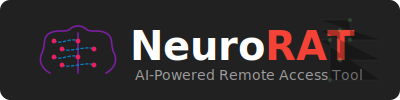
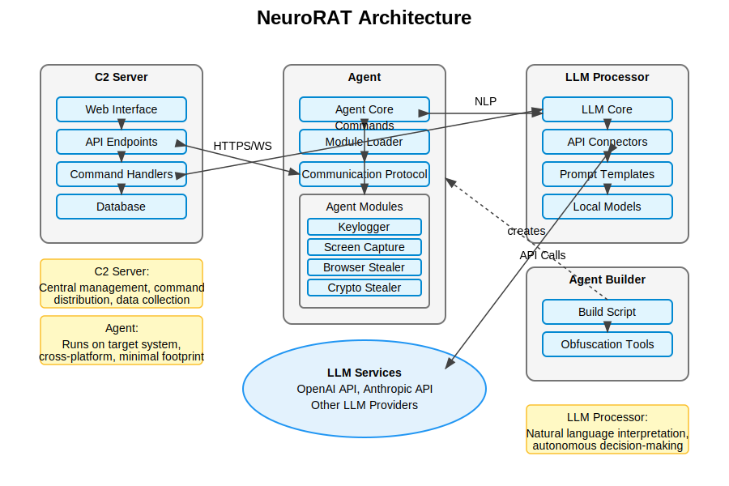

# NeuroRAT



## ⚠️ СЕРЬЕЗНОЕ ПРЕДУПРЕЖДЕНИЕ ⚠️

**ДАННЫЙ ПРОЕКТ ЯВЛЯЕТСЯ СТРОГО ИССЛЕДОВАТЕЛЬСКИМ. СОЗДАН И ОПУБЛИКОВАН ИСКЛЮЧИТЕЛЬНО В НАУЧНЫХ И ОБРАЗОВАТЕЛЬНЫХ ЦЕЛЯХ В РАМКАХ ПРИВАТНЫХ РЕПОЗИТОРИЕВ. ИСПОЛЬЗОВАНИЕ ДАННОГО КОДА В ЛЮБЫХ НЕЗАКОННЫХ ЦЕЛЯХ ЯВЛЯЕТСЯ УГОЛОВНЫМ ПРЕСТУПЛЕНИЕМ.**

**СПЕЦИАЛЬНОЕ ПРЕДУПРЕЖДЕНИЕ:** Модуль `swarm_intelligence.py` содержит потенциально опасный код, который теоретически позволяет объединить все инфицированные системы в единую децентрализованную сеть. **КАТЕГОРИЧЕСКИ ЗАПРЕЩАЕТСЯ** активировать данный модуль вне строго контролируемой исследовательской среды. Этот модуль предназначен исключительно для демонстрации теоретических возможностей децентрализованных атак и разработки соответствующих защитных механизмов.

## Overview

NeuroRAT is an advanced remote access tool designed for penetration testing and security research. It combines traditional RAT capabilities with artificial intelligence through LLM (Large Language Model) integration, enabling autonomous decision-making and natural language command interpretation.

⚠️ **DISCLAIMER: This tool is for EDUCATIONAL PURPOSES ONLY. The author is not responsible for any misuse or damage caused by this program. Only use on systems you have permission to access.**

⚠️ **IMPORTANT NOTICE: This entire codebase was accidentally generated and implemented with the assistance of AI. We have realized that we may have unintentionally created code that could violate laws regarding computer security and unauthorized access tools. We deeply regret this oversight and do not condone the use of this code for any malicious purposes. This repository exists purely for academic understanding of security vulnerabilities.**

## Key Features

- 🤖 **AI-Powered Command Interpretation**: Use natural language to control the agent
- 🔄 **Cross-Platform Compatibility**: Windows, macOS, and Linux support
- 🧩 **Modular Design**: Easily extendable with new capabilities
- 🔒 **Secure Communications**: End-to-end encrypted connections
- 🕵️ **Stealth Operations**: Minimal footprint with anti-detection features
- 🛠️ **Comprehensive Toolkit**: Keylogging, screen capture, data exfiltration, and more
- 🌐 **Децентрализованный ИИ**: Поддержка полностью автономной работы с локальными моделями
- 🧠 **Самообучение**: Адаптация к окружению и оптимизация тактик
- 🔄 **Роевой интеллект**: Распределенное принятие решений (экспериментальный модуль)

## Architecture



NeuroRAT consists of four primary components:

1. **Command & Control (C2) Server**: Central management system
2. **Agent Module**: Client-side execution environment
3. **LLM Processor**: AI-powered natural language understanding
4. **Agent Builder**: Deployment and packaging utility

For detailed architectural information, see [Architecture Documentation](architecture.md).

## Documentation

- [Technical Documentation](technical_docs.md): Detailed developer guide
- [Installation Guide](#installation): Quick setup instructions
- [Usage Guide](#usage): Basic usage instructions
- [Простым языком](простым%20языком.txt): Simple explanation in casual language

## Installation

### Prerequisites

- Python 3.9+
- Git
- virtualenv (recommended)

### C2 Server Setup

```bash
# Clone the repository
git clone https://github.com/your-repository/neurorat.git
cd neurorat

# Create and activate virtual environment
python -m venv venv
source venv/bin/activate  # On Windows: venv\Scripts\activate

# Install dependencies
pip install -r requirements.txt

# Start the server
python server_monitor.py
```

### Agent Deployment

```bash
# Build agent for Windows (EXE)
python build_agent.py --server-host your.server.com --server-port 443 --output dist --type exe

# Build agent for any platform (ZIP)
python build_agent.py --server-host your.server.com --server-port 443 --output dist --type zip

# Generate one-liner for quick deployment
python build_agent.py --server-host your.server.com --server-port 443 --output dist --type base64
```

## Usage

1. Access the web interface at `http://localhost:8080`
2. View connected agents and their details
3. Issue commands using natural language or direct execution
4. Monitor agent activity and collect exfiltrated data

### Example Commands

Using natural language with the LLM processor:

- "Take a screenshot every 5 minutes"
- "Find all passwords stored in web browsers"
- "Monitor keystrokes and send an update every hour"
- "Gather system information and send it back"

## Contributing

Contributions are welcome! Please feel free to submit a Pull Request.

1. Fork the repository
2. Create your feature branch: `git checkout -b feature/amazing-feature`
3. Commit your changes: `git commit -am 'Add some amazing feature'`
4. Push to the branch: `git push origin feature/amazing-feature`
5. Open a Pull Request

## License

This project is licensed under the MIT License - see the [LICENSE](LICENSE) file for details.

## Author

Mr. Thomas Anderson (iamtomasanderson@gmail.com)

GitHub: [Personaz1](https://github.com/Personaz1/) 